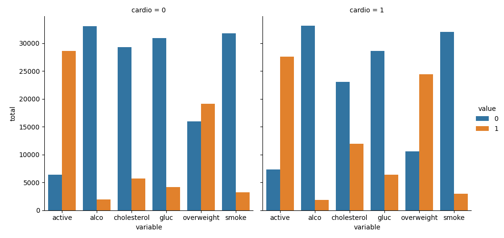

# Medical Data Visualizer

This project is part of the **freeCodeCamp Data Analysis with Python** certification.  
The goal is to process, clean, and visualize patient medical examination data to identify relationships between cardiovascular disease, body measurements, blood test results, and lifestyle choices.

---

## Project Overview

We were provided with `medical_examination.csv`, which contains:

- **age** → Age of the patient (in days)
- **height** → Height (cm)
- **weight** → Weight (kg)
- **gender** → Gender code (categorical)
- **ap_hi** → Systolic blood pressure
- **ap_lo** → Diastolic blood pressure
- **cholesterol** → 1 = normal, 2 = above normal, 3 = well above normal
- **gluc** → 1 = normal, 2 = above normal, 3 = well above normal
- **smoke** → Binary indicator for smoking
- **alco** → Binary indicator for alcohol intake
- **active** → Binary indicator for physical activity
- **cardio** → Binary indicator for presence of cardiovascular disease

The project required creating:
1. **Categorical Plot** — Counts of healthy/unhealthy indicators split by cardiovascular disease status  
2. **Correlation Heatmap** — Relationships between different medical measurements after data cleaning  

---

## Tools & Libraries Used

- **Python** → Core programming language
- **pandas** → Data loading, cleaning, transformation
- **NumPy** → Mathematical operations (BMI calculation, quantiles)
- **matplotlib** → Static plotting framework
- **seaborn** → Advanced statistical visualizations (categorical plots, heatmaps)

---

## Data Processing & Cleaning

### 1. Add Overweight Column
Body Mass Index (BMI) is calculated as:

```python
BMI = weight / (height/100) ** 2
```

Patients with BMI > 25 are marked as **overweight = 1**, otherwise **overweight = 0**.

---

### 2. Normalize Cholesterol & Glucose
Converted values so that:
- `0` → good  
- `1` → bad  

```python
df['cholesterol'] = (df['cholesterol'] > 1).astype(int)
df['gluc'] = (df['gluc'] > 1).astype(int)
```

---

### 3. Clean Data for Heatmap
Filtered out incorrect or extreme values:
- `ap_lo <= ap_hi` (valid blood pressure)
- Height within 2.5th–97.5th percentile
- Weight within 2.5th–97.5th percentile

---

## Visualizations

### 1. Categorical Plot (`catplot.png`)
**Shows:** Distribution of binary health indicators (cholesterol, gluc, smoke, alco, active, overweight) split by `cardio` status.  
**Purpose:** Compare prevalence of healthy/unhealthy habits and measurements between patients with and without cardiovascular disease.  
**Method:** `seaborn.catplot(kind='count')` after reshaping data with `pd.melt()`.

---

### 2. Correlation Heatmap (`heatmap.png`)
**Shows:** Pearson correlation coefficients between medical variables (after cleaning).  
**Purpose:** Identify strong positive or negative correlations between features.  
**Special Features:**  
- Masked upper triangle for clarity  
- Annotated with values rounded to 1 decimal place  
- Color-coded correlation strength

---

## Files in This Project

- **medical_data_visualizer.py** → Main script for data processing and visualization
- **medical_examination.csv** → Dataset containing patient medical records
- **catplot.png** → Generated categorical plot
- **heatmap.png** → Generated correlation heatmap
- **test_module.py** → Provided by freeCodeCamp for automated testing
- **README.md** → This file, describing the project

---

## Example Images

| Cat Plot | Heat Plot | 
|-----------|----------|
|  |  |

---
