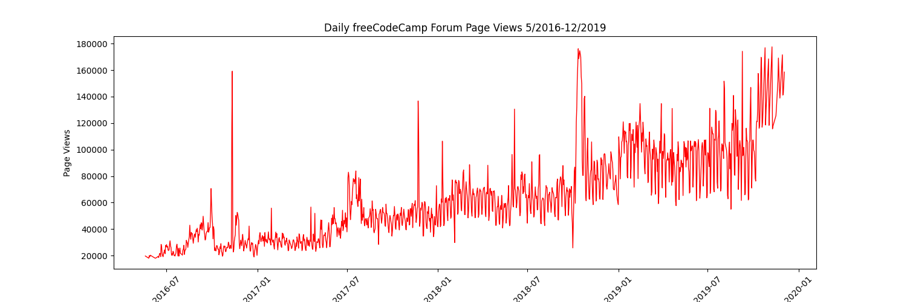

# Page View Time Series Visualizer

This project is part of the **freeCodeCamp Data Analysis with Python** certification.  
The goal is to visualize forum page view data over time to identify trends, seasonality, and outliers.

---

## Project Overview

We were provided with `fcc-forum-pageviews.csv`, which contains:

- **date** → The date of measurement
- **value** → Number of page views on that date

The project required creating:
1. **Line Plot** — Trends over time  
2. **Bar Plot** — Average monthly page views per year  
3. **Box Plots** — Yearly trends & monthly seasonality  

---

## Tools & Libraries Used

- **Python** → Core programming language
- **pandas** → Data loading, cleaning, and manipulation
- **matplotlib** → Static plots (line, bar)
- **seaborn** → Advanced statistical plots (box plots)
- **NumPy (indirectly via pandas)** → Quantile calculations for outlier removal

---

## Data Cleaning

We removed extreme outliers using the **2.5th and 97.5th percentiles**:

```python
df = df[
    (df['value'] >= df['value'].quantile(0.025)) &
    (df['value'] <= df['value'].quantile(0.975))
]
```

This ensures our visualizations focus on the main data distribution without distortion from anomalies.

---

## Visualizations

### 1. Line Plot (`line_plot.png`)
**Shows:** Daily page views from May 2016 to December 2019.  
**Purpose:** Identify overall trends and fluctuations over time.  
**X-axis:** Date  
**Y-axis:** Page Views  
**Style:** Red line, rotated x-ticks for clarity.

---

### 2. Bar Plot (`bar_plot.png`)
**Shows:** Average monthly page views for each year.  
**Purpose:** Compare seasonal changes and annual performance.  
**X-axis:** Years  
**Y-axis:** Average Page Views  
**Legend:** Month names (January → December)  

**Calculation:**
```python
df_bar['year'] = df_bar.index.year
df_bar['month'] = df_bar.index.month
df_grouped = df_bar.groupby(['year', 'month'])['value'].mean().unstack()
```

---

### 3. Box Plots (`box_plot.png`)
Two plots side by side:
1. **Year-wise Box Plot (Trend)** → Distribution of page views per year  
2. **Month-wise Box Plot (Seasonality)** → Seasonal patterns across years  

**Purpose:**  
- Year-wise: See overall trend and variability per year  
- Month-wise: Detect seasonal peaks and dips

---

## Example Images

| Line Plot | Bar Plot | Box Plots |
|-----------|----------|-----------|
|  |  |  |

---

---

