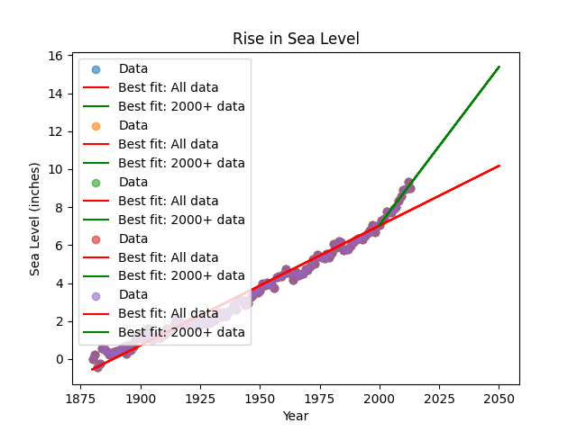

# Sea Level Predictor

This project is part of the **freeCodeCamp Data Analysis with Python** certification.  
The goal is to analyze historical sea level data and predict future levels using **linear regression**.

---

## Project Overview

We were provided with `epa-sea-level.csv`, which contains:

- **Year** → Year of measurement  
- **CSIRO Adjusted Sea Level** → Global average absolute sea level change (in inches) adjusted for seasonal effects

The project required creating a visualization that includes:
1. **Scatter Plot** — Historical sea level measurements  
2. **Regression Line (All Data)** — Prediction based on the entire dataset (1880 → latest year)  
3. **Regression Line (2000+)** — Prediction based on recent trends (2000 → latest year)

---

## Tools & Libraries Used

- **Python** → Core programming language  
- **pandas** → Data loading and manipulation  
- **matplotlib** → Visualization  
- **scipy.stats.linregress** → Linear regression calculations  
- **NumPy (via pandas)** → Creating extended year ranges for predictions

---

## Data Cleaning

Minimal cleaning was required.  
We only needed to ensure that:
- Columns were correctly selected (`Year` and `CSIRO Adjusted Sea Level`)
- Data was split into **full dataset** and **2000+ subset** for separate regressions.

---

## Analysis & Visualizations

### 1. Scatter Plot with Regression Lines (`sea_level_plot.png`)

**Shows:**  
- **Blue dots** → Historical sea level measurements (1880 → most recent year)  
- **Red line** → Regression line based on the **entire dataset**, extended to the year 2050  
- **Green line** → Regression line based on **data from 2000 onwards**, also extended to 2050

**Purpose:**  
- The red line gives a long-term historical trend.  
- The green line highlights more recent changes, showing whether the rate of sea level rise has accelerated.

**X-axis :** Year  
**Y-axis :** Sea Level (inches)  
**Legend :** Data points, All data best-fit line, 2000+ best-fit line

---

## Predictions

The regression equations are used to predict sea level in the year 2050:

**Sea Level = (slope × Year) + intercept**
- **Full dataset regression** → Prediction accounts for long-term historical trends  
- **2000+ regression** → Prediction focuses on more recent changes

---

## Data Source

Global Average Absolute Sea Level Change, 1880-2014 from the **US Environmental Protection Agency**  
Data originally compiled from:
- **CSIRO**, 2015
- **NOAA**, 2015

---

## Files in This Project

- **sea_level_predictor.py** → Main module containing:
  - Data loading
  - Scatter plot
  - Regression calculations and plotting
- **test_module.py** → Provided by freeCodeCamp for automated testing  
- **epa-sea-level.csv** → Dataset containing year and adjusted sea level measurements  
- **sea_level_plot.png** → Generated plot with scatter data and regression lines  
- **README.txt** → This file, describing the project details

---
